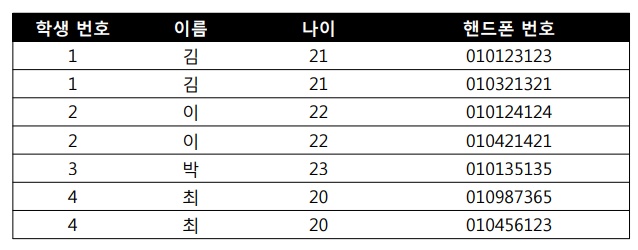
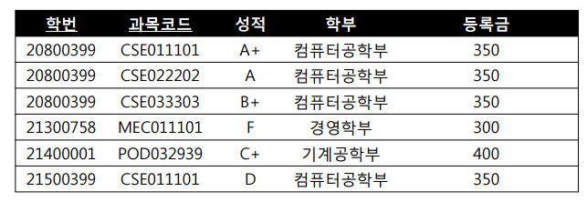
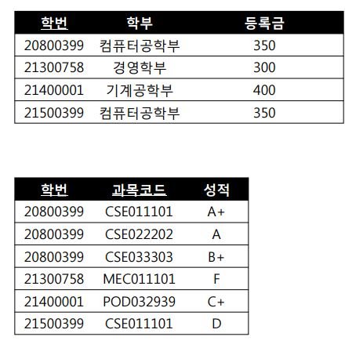
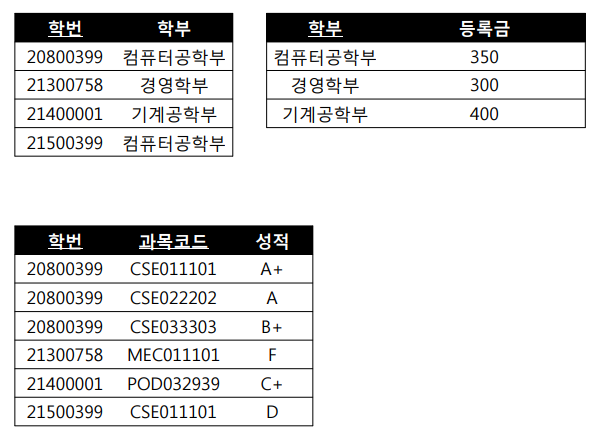

# DataBase

데이터를 저장하는 최고의 방식 :cd:   

## 목차

1. [트랜잭션 격리수준](#트랜잭션-격리수준)
2. [트랜잭션 상태](#트랜잭션-상태)
3. [정규화](#정규화)
4. [NoSql](#NoSql)


## 트랜잭션 격리수준

트랜잭션 격리수준이란?  

동시에 여러 트랜잭션이 처리될 때, 트랜잭션끼리 얼마나 고립되어 있는지 나타내는 것. 

1. READ UNCOMMITED
2. READ COMMITED
3. REPEATABLE READ
4. SERIALIZABLE

아래로 내려갈 수록 트랜잭션 고립 정도가 높아지며, 성능이 떨어진다. 

> Oracle - READ COMMITED, Mysql = REPEATABLE READ

```text
잠깐, 트랜잭션의 성질(ACID)은?
1. Atomicity(원자성): 트랜잭션의 모든 연산들은 정상적으로 수행하거나, 수행되지 않은 상태를 보장해야한다
2. Consistency(일관성): 트랜잭션 완료 후에도 데이터베이스가 일관된 상태를 유지해야 한다
3. Isolation(독립성): 하나의 트랜잭션이 수행되는 동안 다른 트랜잭션이 참조하지 못한다
4. Durability(지속성): 성공적으로 수행된 트랜잭션은 영원히 반영되어야 한다
```


### READ UNCOMMITED

이 수준에서는 **어떤 트랜잭션의 변경내용이 COMMIT 이나 ROLLBACK 에 상관없이 다른 트랜잭션에서 보여진다**.  

1. A 트랜잭션에서 10번 사원의 나이를 27 -> 28
2. 아직 커밋하지 않음
3. B 트랜잭션에서 10번 사원의 나이를 조회
4. 28살이 조회됨 = **Dirty Read**
5. A 트랜잭션에서 ROLLBACK 처리
6. B 트랜잭션은 여전히 28 로 처리

이 단계는 데이터 정합의 문제가 많으므로 격리 수준으로 인정하지도 않음. 

### READ COMMITED

**어떤 트랜잭션에서 변경내용이 COMMIT 되어야만 다른 트랜잭션에서 조회가 가능**. 

여기서는 B 트랜잭션에서 10번 사원의 나이가 28로 조회되지 않고, 27로 조회된다!  

단 아래와 같은 상황이 발생할 수 있다. 

1. B 트랜잭션에 10번 사원의 나이를 조회
2. 27살이 조회됨
3. A 트랜잭션에서 10번 사원의 나이를 27 -> 28 설정 후 COMMIT
4. B 트랜잭션에서 다시 나이를 조회
5. 28살이 조회됨

똑같은 `SELECT` 문을 반복하고 있는데도, 항상 같은 결과를 반환해야 한다는 `REPEATABLE READ` 에 어긋나는 정합성이다. 

### REPEATABLE READ

이 수준은 **트랜잭션이 시작되기 전에 커밋된 내용에 대해서만 조회할 수 있는 격리수준** 이다. 

1. 10번 트랜잭션이 10번 사원을 조회
2. 12번 트랜잭션이 10번 사원의 이름을 변경하고 커밋
3. 10번 트랜잭션이 다시 10번 사원을 조회
4. 조회한 데이터는 변하지 않음

이 경우에는 **자신의 트랜잭션 번호보다 낮은 트랜잭션 번호에서 변경된 것** 만 보게 되는 것이다. 

단 이 수준에서도 아래와 같은 데이터 부정합이 발생할 수 있다. 

1. UPDATE 부정합: UPDATE를 한 트랜잭션 내에 2번 실행할 경우, 발생할 수 있다
2. Phantom READ: 한 트랜잭션에서 2번의 쿼리를 실행하는데, 한번의 쿼리에서 없던 데이터가 나올 수 있다

### SERIALIZABLE

이 수준에서는 단순한 읽기 작업의 경우에도 `공유 잠금` 을 설정하게 되고, 이러면 다른 트랜잭션에서도 이 레코드를 변경하지 못한다. 

그래서 동시처리 능력이 많이 떨어지고, 성능저하가 발생하게 된다. 


## 트랜잭션 상태

트랜잭션에도 상태가 있다는 것을 아시나요? :station:  

* Active: 트랜잭션이 동작중인 상태

* Failed: 트랜잭션이 실패한 상태

* Partially Commited: 트랜잭션에 `Commit` 명령이 도착한 상태, `sql` 문이 실행되고 남은 `commit` 만 남은 상태를 의미한다

  > 이 단계에서 Commit에 문제가 발생하면, `Failed` 상태로 돌아가게 된다. 성공하면 `Commited` 상태

* Commited: 트랜잭션이 성공적으로 완료한 상태

* Aborted: 트랜잭션이 취소되고, 트랜잭션 실행 이전의 데이터로 돌아간 상태


## 정규화

한 릴레이션에 여러 엔티티들의 중복을 최소화하기 위해서 `정규화` 라는 개념이 탄생하게 되었다. 

여러 중복된 데이터들을 같이 저장하게 되면, **갱신 이상** 이 발생하기 때문이다. 

그렇다면 **갱신 이상** 에는 어떤게 있을까?

1. 삽입 이상
2. 삭제 이상
3. 수정 이상

그래서 정규화란?

```text
좀 더 불만족스러운 나쁜 릴레이션의 애트리뷰트들을 나누어서 좋은 작은 릴레이션으로 분해하는 작업
```

그럼 여기서 말하는 **나쁜 릴레이션** 이란?  

함수적 종속성을 만족하지 못하는 정규형이 바로 나쁜 릴레이션이다. 

* 분해의 대상인 분해 집합 D 는 무손실 조인을 보장하고
* 분해 집합 D 는 함수적 종속성을 보존해야하더라

### 제 1정규형

Attribute의 도메인이 오직 `원자값` 을 포함하고, 튜플의 모든 Attribute가 도메인에 속하는 하나의 값을 가진다. 

<div>
  
</div>


### 제 2정규형

모든 비주요 Attribute들이 주요 Attribute에 대해서 **완전 함수적 종속성** 을 가진다면, 제 2정규형을 만족한다라고 볼 수 있다. 

완전 함수적 종속성이란, `X -> Y` 의 관계에서 `X` 의 어떠한 Attribute를 제거하면 더 이상 함수적 종속성을 만족하지 못할떄를 의미한다. 

예를 들면 아래와 같은 테이블에서, 

<div>
  
</div>

학번(X)에 따라 학부(Y)와 등록금을 결정하고, 학번(X)에 따라 과목코드(Y)와 성적을 결정하게. 

아래와 같이 변경하는 것이다

<div>
  
</div>

### 제 3정규형

어떠한 비주요 Attribute도 기본키에 대해서 **이행적으로 종속되지 않으면** 제 3정규형을 만족한다. 

`X -> Y` , `Y -> Z` 의 경우 추론될 수 있는 `X -> Z` 의 종속관계를 의미한다.   

위의 예시에서 학번(X)가 학부(Y)를 결정하고, 학부(Y)가 등록금(Z)를 결정하는 관계를 의미한다

<div>
  
</div>

### 정규화의 장단점

먼저 장점으로는

* 데이터베이스 변경시 이상 현상을 제거할 수 있다
* 데이터베이스 구조 확장시 새로운 데이터 행을 추가해도 구조를 변경하지 않아도 된다 (변화에 유연)
* 사용자에게 데이터 모델을 더욱 의미있게 제공하고, 현실세계와 같이 반영된다

단점으로는

* 릴레이션 간의 연산(`JOIN` 연산) 이 많아져서, Query 에 대한 시간이 많이 느려질 수 있다
* 그래서 정규화된 테이블은 데이터를 처리할 때 속도가 빨라질 수도, 느려질 수도 있는 특성이 있다

그렇다면 정규화를 돌릴 수 있는 방안은 있는가?

### 반정규화

조회를 하는 **SQL 문장에서 JOIN 이 많이 발생하여 이로 인해 성능저하** 가 나타날 경우 반정규화를 적용하더라. 

반정규화는 주로 테이블끼리 경로가 너무 멀어서 조인으로 인해 성능 저하가 예상되거나,  

**칼럼을 계산하여 조회할 때 성능이 저하될 것** 으로 예상되면 실시한다. 

주요 대상은?

1. 자주 사용되는 테이블에 액세스하는 프로세스 수가 가장 많고, **항상 일정한 범위만 조회** 하는 경우
2. 테이블에 대량의 데이터가 있고, **대량의 범위를 자주 처리** 하는 경우
3. 테이블에 지나치게 조인을 많이 사용하여 **데이터를 조회하는데에 기술적으로 어려움** 을 겪는 경우


## NoSql

Not Only SQL. 

관계형 데이터베이스 모델을 **지양** 하며, 느슨한 스키마를 제공하는 데이터베이스 저장소. 

동적인 스케일 아웃을 지원하며, 가용성을 위해 데이터 복제 등의 방법으로 관계형 데이터베이스가 제공하지 못하는 성능과 특징을 제공. 

비관계형 데이터베이스에, 비구조적인 데이터를 저장하기 위한 분산 저장 시스템. 

그렇기 때문에 **더 융통성있는 데이터 모델** 을 사용하고, **데이터 저장 및 검색을 위한 특화된 매커니즘** 을 제공


### CAP 이론

1. Consistency(일관성): 다중 클라이언트에서 같은 시간에 조회하는 데이터는 항상 동일한 데이터임을 보증하는 것

2. Availability(가용성): 모든 클라이언트에서 읽기와 쓰기 요청에 대하여 항상 응답이 가능하다는 것을 보증. 

3. Partition tolerance(네트워크 분할 허용성): 지역적으로 분할된 네트워크 환경에서는 네트워크 데이터의 유실이 일어나도 각 지역내의 시스템은 정상적으로 동작해야 된다를 의미함

   > 네트워크 장애가 일어나냐를 의미한다. 제대로 Replication이 되는지 보는 것. 
   >
   > A, B, C 노드가 있는데 B 노드의 네트워크 장애로 이어져도 제대로 서비스를 할 수 있느냐를 물어본다

보통 데이터베이스는 CAP 이론중에서 2가지만 만족할 수 있는데,  

`Nosql` 은 여기서 **AP** 를 만족하는 특성을 가지고 있고,  

> NoSql ex) DynamoDB 를 사용하다 보면 종종 데이터 정합이 가끔씩 깨질때가 있다.

`RDB` 은 여기서 **CA** 를 만족하는 특성을 가지고 있고,  

> 그래서 RDB의 경우에는 Partitioning과, Sharding이라는 개념이 존재한다.

`Redis/MongoDB` 의 경우 여기서 **CP** 를 만족하는 특성을 가지고 있다.   

> 보통 Cache로 사용하는 저장소들의 특징이다. ( 일시 장애로 읽기 쓰기가 불가능해도 서비스 장애로 이어지지 않는다 )


