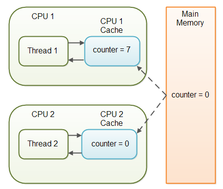

# Java

국내 백엔드 개발자라면, 누구나 한번쯤 접해보았을만한 내용들 :jack_o_lantern:  

( 사실 중급자 이상으로 작성된 부분이 참 많습니다 )

## 목차

1. [volatile](#volatile)
2. [멀티 쓰레드](#멀티 쓰레드)


## volatile

`volatile` 키워드는 Java 변수를 메인 메모리에 저장하겠다 라는 것을 명시하는 키워드. 

매번 변수의 값을 Read할 때, CPU cache에 저장된 값을 읽는 것이 아닌 Main Memory에서 읽는 것이다. 

또한 변수의 값을 Write할 때, 항상 Main Memory까지 작성하는 것을 의미한다. 

<br>

*왜 이러한 키워드를 사용할까요?*   

<br>

**Multi Thread** 환경에서 동일한 자원에 대해 접근을 시도할 때, 동시성의 문제로 `변수 값 불일치 문제` 가 발생하기 때문에 사용한다. 

```java
public class SharedObject {
  public volatile int counter = 0;
}
```

라는 객체가 있다면, 

<div>
  
</div>

위 처럼 **동시접근(read)에 대한 상황** 이 존재하고, **하나의 Thread 에서만 write** 되는 경우. 

`volatile` 키워드를 쓰기 적합한 제일 좋은 상황이라는 것을 알 수 있다. 

하지만, 아래처럼 여러 Thread 에서 동시에 write 하는 상황의 경우. 

<div>
  
</div>

`volatile` 키워드만으로 데이터에 대한 일관성을 보장하기가 힘들다. 

> 왜냐하면 2개의 Thread 에서 +1 이라는 연산을 수행했지만, 결과값이 항상 2 라는 것을 보장하기가 힘들다. 
>
> (write 하는 시간이 꼬일 수 있기 때문)

#### 성능 이슈

그리고 아무래도 Main Memory에 직접적으로 접근되는 키워드다보니, CPU cache 보다 더 비싼 연산이고,  

JVM 의 `GC` 과정중의 하나인 Memory Relocation에 대해 직접적으로 연관이 되어 있으니 꼭 필요한 경우에만 사용하도록 하자. 


## 멀티 쓰레드

자바에서 멀티 쓰레드를 스케줄링하기 위해서는 `우선순위(Priority)` 방식과 `순환 할당(Round-Robin)` 방식을 사용합니다. 

* 우선순위: 우선순위가 높은 쓰레드가 실행 상태를 더 많이 가지도록 스케줄링
* 순환할당: 시간 할당량을 정해서 하나의 쓰레드를 정해진 시간만큼 실행시키고, 다시 다른 쓰레드를 실행하는 방식

다시 말해서, 우선순위 방식은 **우선순위 번호를 개발자가 코드로 제어** 할 수 있지만,  

순환할당 방식은 **자바 가상 기계(JVM)에 의해 제어** 되기 때문에 코드로 제어할 수 없는 차이점이 있습니다. 

<br>

*이렇게 쓰레드 챕터가 끝난다면 너무나 허무하겠죠?*

### Timer

자바에서는 쓰레드 스케줄링을 위한 **API** 가 구성되어 있는데, 이것이 바로 `Timer` 입니다. 

`Timer` 로 어떤 Task를 스케줄링 할 것인지 결정하고, `TimerTask` 로 해당 작업을 설정하여 실행하게 됩니다. 

```java
    @Test
    @DisplayName("TimerScheduling 테스트")
    void timerScheduling_test() throws InterruptedException {
        /* given */
        final TimerTask timerTask = new TimerTask() {
            @Override
            public void run() {
                System.out.println("Task Performed on: " + LocalDateTime.now());
            }
        };
        final Timer timer = new Timer("timer");
        long delay = 1000L;

        /* when */
        System.out.println("Main Performed on: " + LocalDateTime.now());
        timer.schedule(timerTask, delay);

        Thread.sleep(delay * 2);
    }
```

TimerTask로 어떤 일이 수행될 것인지를 지정하고, timer 객체가 특정 시간의 delay 이후에 task를 실행하는 방식입니다. 

물론, 특정 시간에 대한 설정을 지정하고 스케줄링도 가능합니다. 

다만 너무 Too Much 인 것 같아 생략합니다 ㅎㅎ. 

### TheradPoolExecutor

자바에서는 ThreadPool 을 관리해주는 인터페이스가 이미 존재한다. 

그것이 바로 `ThreadPoolExecutor` 이니 ThreadPoolExecutor의 생성자에는 여러 옵션들이 존재한다. 

* `corePoolSize` : 최초 생성되는 쓰레드 풀 사이즈. 무조건 해당 쓰레드풀을 유지하려고 하게 된다

* `maximumPoolSize` : 해당 Pool 에서 최대로 유지할 수 있는 쓰레드풀

* `keepAliveTime` : corePoolSize를 초과하여 maximumPoolSize까지 생성되는데, 초과한 **쓰레드풀을 유지할 수 있는 시간**

* `unit`: keepAliveTime의 시간 단위

* `workQueue` : corePoolSize보다 쓰레드가 많아졌을 경우, task들을 queue에 쌓아 놓는다. 여러 종류의 queue들이 존재한다

  * SynchronousQueue: **Direct handsoff**. 기본적으로 task들을 holding하지 않고, 다른 thread에게 바로 위임해버린다. 

    > 그래서 버퍼공간이 없는 queue다. 만일 thread가 task를 가져가지 못한다면 blocking 되버리게 된다

  * LinkedBlockingQueue: **Unbounded queue**. 한마디로 size의 한계가 존재하지 않는 queue이기 때문에 task의 처리속도보다 누적되는 속도가 빠르다면 무한으로 작업대기열이 증가하게 된다.

    > 버퍼공간이 무한대인 queue. 정확히는 메모리가 허용하는 선까지 task들을 쌓아놓을 수 있다

  * ArrayBlockingQueue: **Bounded queue**. queue size에 해당하는 task가 초과하게 되면, error가 발생한다

사실상 제일 중요한 것은 어떤 queue을 설정한 것인지가 제일 중요합니다. 

보통 우리가 필요한 표준들은 대부분 `Executors` 의 static 메서드로 정의되어 있으니,  

필요하실 때마다 **Java Doc** 을 읽는 건 참 좋은 습관일 것 같네요 :smile:   


