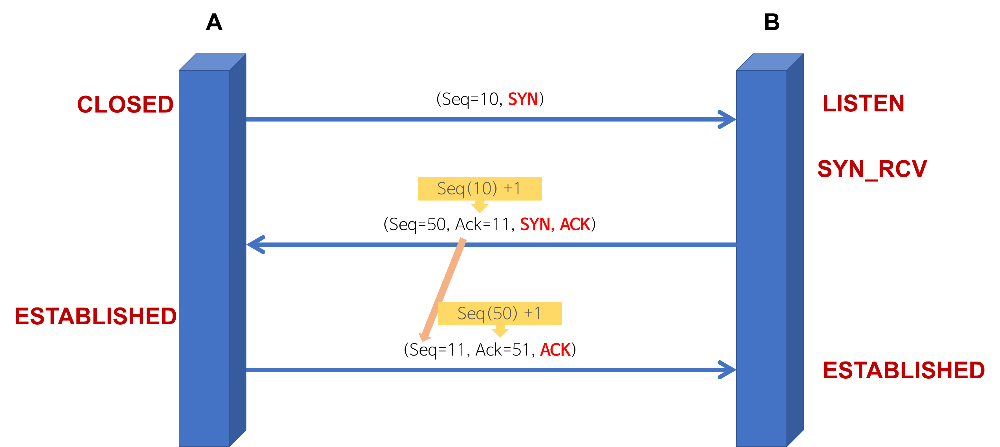
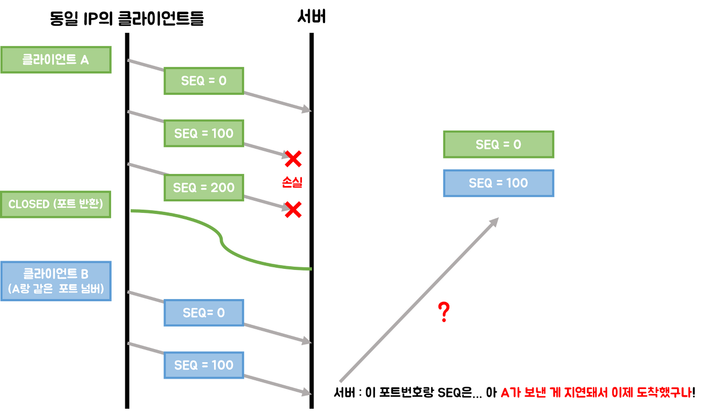
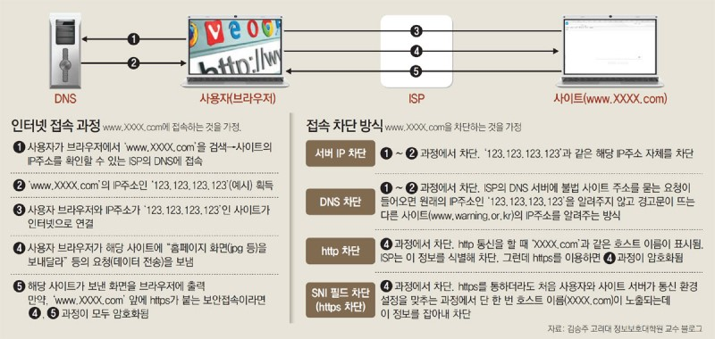
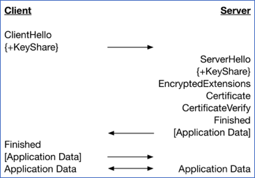
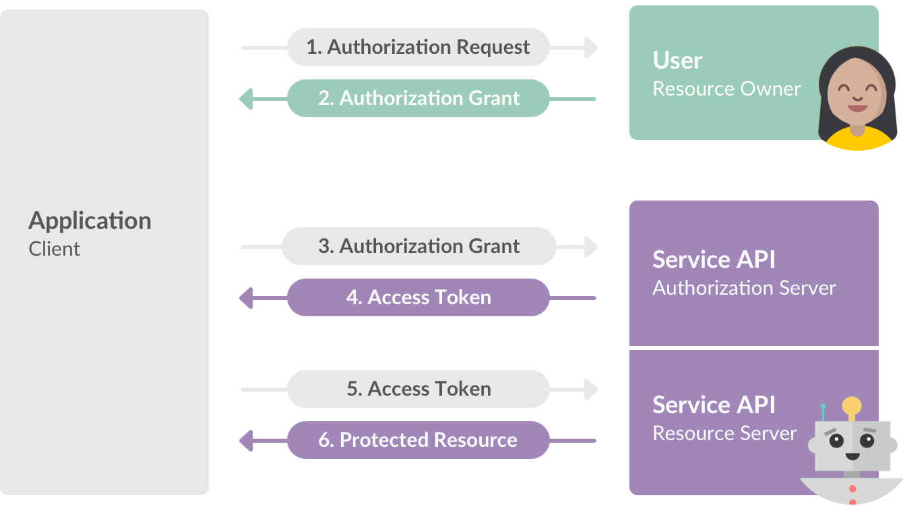

# Network

통신하기 위한 기본 소양 :link:  

## 목차

1. [RESTful](#RESTful)
2. [TCP](#TCP)
3. [HTTP HTTPS](#HTTP-HTTPS)
4. [Chorme에 www.naver.com 을 입력하면?](#Chorme에-www.naver.com-을-입력하면?)
5. [OAuth](#OAuth)


## RESTful

`REST` : Representation State Tranfer 라는 용어의 약자로, 2000년도에 로이 필딩의 박사학위 논문에서 소개.  

### 구성

1. 자원(Resource): uri
2. 행위(Verb): HTTP METHOD
3. 표현(Representations)

위와 같은 구성 때문에 **REST** 서버는 다음과 같은 특징이 있어요.  

* Uniform(유니폼 인터페이스): 지정한 리소스에 대한 조작을 통일되고, 한정적인 인터페이스로 수행하는 아키텍처 스타일
* Stateless(무상태성): 작업을 위한 상태정보를 가지지 않고, 관리하지 않는다 
* Cacheable(캐시 가능): HTTP 라는 표준을 활용하기 때문에 `Last-Modified` 태그 혹은 `E-Tag` 를 이용해서 캐싱가능
* **Self-descriptiveness(자체 표현 구조)** : REST API 메세지만 보고도 이를 쉽게 이해할 수 있는 자체 표현 구조
* Client - Server: 역할간의 구분이 명확하고, 서로간의 의존성이 많이 줄어들게 됨
* 계층형 구조: 다중 계층으로 구성될 수 있으며, 구조상의 유연성을 얻을 수 있음

### 디자인 방식

1. `URI` 는 정보의 자원을 표시해야 한다
2. 자원에 대한 행위는 `HTTP Method` 로 표현한다 (GET, POST, PUT, DELETE)

<br>

### REST 이대로 괜찮은가

네이버의 [그런 REST API로 괜찮은가?](https://www.youtube.com/watch?v=RP_f5dMoHFc) 를 보시면. 

요즘의 `REST` 는 `REST` 하다고 볼 수 없는데, 대부분 **uniform interface** 의 특성을 만족하지 않고 있다

* Self-Descriptiveness 한 특성들이 많이 없고 = **메세지가 스스로 자신의 상태를 설명해야 된다**
  * profile 을 읽을 수 있는 link가 필요하다
* Hypermedia as the engine of application state (HATEOS) = **Client Hyperlink로 통해서 상태를 전이해야 한다**
  * 다음 상태로 요청할 수 있는 link 정보가 필요하다

이 2가지를 거의 지키지 못하고 있다 (ex) v1/book, v2/book 같은 버져닝도 문제).  

그렇기 때문에 위 2가지 특성을 만족시킬 해결책으로는. 

`profile 링크 데이터` 를 추가하면 된다.   

다시말해서, **HAL(Hypertext Application Language)** 를 통해 Response 메세지에 링크 정보를 전달하면 된다

적용하는 방법

* [REST API에 HAL 적용하기](https://blog.aliencube.org/ko/2015/08/16/applying-hal-to-rest-api/)


## TCP

어떻게 연결에 대한 신뢰성을 보장할 수 있을까?  

* 3-way handshaking
* 4-way handshaking
* 혼잡 제어(Congestion Control)
* 흐름 제어(Flow Control)

### 3-way handshaking

<div>
  
</div>


먼저 Client는 Server에게 `랜덤 난수(ISN)`을 사용해서 Seq을 만들고 SYN 요청을 보낸다. 

그 다음 Server는 Client가 보낸 `난수+1` 에 대한 응답으로 ACK를 보내고, Server도 마찬가지로 랜덤 난수로 Seq을 보낸다. 

> 이 과정에는 접속 요청을 수락하고, 접속을 위한 Port 개방을 Client에게 요구하는 것이다

마지막으로 Client는 알았다 라는 응답으로 ACK를 통해 연결이 성립되는 것이다.

>  이 단계에서 결국 커넥션이 맺어지고, 데이터를 보낼 수 있게 되는 것

### ISN을 난수로 사용하는 이유?

크게 2가지 이유가 있는데요..  

첫번째는, Connection을 맺을 때 사용하는 포트(port)는 일정한 범위 내에서 항상 재사용되는데,  

**클라이언트와 서버가 과거에 사용했던 포트(port)쌍을 사용하는 가능성이 존재할 수도 있다**. 

<div>
  
</div>


이 경우에 서버 측에서는 패킷의 SYN을 보고 패킷을 구분하게 되는데, 난수가 아닌 순차적인 Number가 전송된다면. 

이전의 Connection으로부터 오는 패킷으로 인식할 수가 있다.  

이러한 문제를 예방하기 위해 난수로 ISN을 사용한다. 

두 번째 이유로는, `0` 에서 시작하는 ISN은 아주 쉽게 다음 `Seq Num` 을 예측할 수 있기 때문에,  

**TCP Sequence prediction attack** 등의 공격에 매우 취약할 수 있기 때문이다. 


### 4-way handshaking

<div>
  
</div>


이 과정에서는 Client와 Server 둘 다 `커넥션을 종료할 수 있음` 에 유의하고 읽었으면 좋겠다. 

1. 먼저 `close()` 를 실행한 Client 쪽에서 FIN 을 보내고, **FIN WAIT** 상태에 돌입하게 된다
2. 그 다음 이 요청을 받은 Server는 **CLOSE WAIT** 상태로 전이하고, ACK를 전달한 뒤 해당 포트에 있는 어플리케이션에 `close` 를 요청한다
3. ACK를 받은 Client는 다시 **FIN WAIT2** 상태에 돌입한다
4. Server에서 성공적으로 포트를 닫으면, 종료 프로세스에 돌입하고 `FIN` 을 전송해 **LAST ACK** 상태로 전이한다
5. Client는 이때 FIN에 대한 ACK를 Server에게 보내고, **TIME WAIT** 상태로 전이한다
6. 이제 일정시간이 지나게 되면 Client의 **TIME WAIT** 상태는 풀리고, 성공적으로 `CLOSED` 된다. 물론 서버도 ACK를 받자마자 `CLOSED` 된다

이 과정에서 `CLOSE WAIT` 상태가 지속되거나, `TIME WAIT` 상태가 지속되는 현상이 발생할 수도 있는데,  

<br>

`CLOSE WAIT` 가 지속된다는 것은.  

어플리케이션 자체에 문제가 있는 것이므로, **포트를 잡고 있는 프로세스를 종료하거나 네트워크 재시작** 외에는 딱히 방법이 없다. 

`TIME WAIT` 가 지속된다는 것은,  아주 정상적인 현상이다. 

`TIME WAIT` 이 필요한 이유는. 

* 지연 패킷이 발생한 경우, 데이터 무결성 문제 때문에
* 원격 종단의 연결이 닫혔는지 확인해야 되기 때문에

그래서 TCP `TIME WAIT` 는 **무조건 60초로 상수 하드코딩** 되어 있다

<br>


## HTTP HTTPS

`HTTP` 프로토콜이란?

```text
일명 HyperText Transfer Protocol
80번 포트가 기본 포트이며, TCP와 UDP를 바탕으로 동작한다
```

HTTP 프로토콜은 기본적으로

* 비연결(Connectionless): 클라이언트와 서버가 서로 요청을 주고 받으면 연결이 끊긴다
* 무상태(Stateless): 연결을 끊는 순간 클라이언트와 서버는 통신이 끝나며 상태 정보를 유지하지 않는다

하지만 연결을 계속유지하고 싶다면?  

우리에겐 `HTTP/1.1` 의 **Keep-alive** 헤더가 있으니 명시하면 된다. 

But, `HTTP 1.1` 에는 고질적인 문제가 있었으니, 그것은 바로 **Connection당 하나의 요청만 처리** 가 가능하므로. 

기본적으로 Blocking 방식의 통신이라 **동시전송이 불가능** 하다는 단점이 있었다. 

> 그래서, HOL(Head Of Line) 이라는 특정 응답의 지연 때문에 전체적으로 많이 느리다 (순차 처리 방식)

<div>
  
</div>


### HTTP2

그래서 구글에서 SPDY 라는 비표준형 개방형 네트워크 프로토콜을 바탕으로 새롭게 나온 것이 바로. 

`HTTP/2.0` 인 것이다. 

2.0 에서는 평문(text) 기반이 아니라 바이너리 포멧으로 인코딩된 Message, Frame 으로 구분한다.!  

<div>
  
</div>


그리고 기본적으로 하나의 Connection으로 여러개의 Message를 여러개의 Frame으로 요청이 가능하기 때문에. 

이를 `Multiplexed Stream` 처리방식이라고도 일컫는다!

<div>
  
</div>


또한 **HTTP Header Data Compression (HTTP 헤더 데이터 압축)** 을 지원하며. 

그렇기 떄문에 데이터 전송에 대한 효율을 많이 높였다 (왜냐하면 HTTP 헤더는 중복되는게 상당히 많기 때문이다)

```text
Huffman Coding에 따라 압축: 데이터 문자 빈도에 따라서 다른 길이의 부호를 사용하는 알고리즘
```

<div>
  
</div>


요렇게 중복되는 Header들을 사전에 미리 검출하고, 중복되지 않은 값은 Encoding 하는 방식을 일컫는다. 

* [나만 모르고 있던 - HTTP/2](https://www.popit.kr/%EB%82%98%EB%A7%8C-%EB%AA%A8%EB%A5%B4%EA%B3%A0-%EC%9E%88%EB%8D%98-http2/)

<br>

아직 정식으로 발매되지 않은 `HTTP/3.0` 은 Google의 QUIC 을 바탕으로한 **UDP** 방식이니 참고드린다. 

> 관심있으면 더 찾아보자

<br>

### HTTPS

쉽게 이야기하면 `HTTP` 에서 `TLS` 프로토콜을 사용해서 통신하는 방식이다. 

HTTPS 는 기본적으로 다음과 같은 특성을 만족시키기 위해 사용한다

* 기밀성: 공공 매체에서 두 참여자간의 통신을 보호하기 위함
* 무결성: 변조되지 않는 정보로 목적지에 도달하게 하기 위함
* 인증: 웹 사이트의 진위 여부를 판별하기 위함

<div>
  
</div>


`HTTPS` 에서 사용되는 핵심적인 암호화 방식은 결국 **대칭키** / **공개키** 방식이다. 

* 대칭키: 통신하고자 하는 서로의 당사자들이 공통 비밀 키를 공유한다
* 공개키: 당사자 중 한쪽이 비밀키와 공개키의 쌍을 가진다

HTTPS에서 안전한 연결을 기반으로 통신하기 위해서는, 공개키 방식으로 서로의 대칭키를 주고 받는 방식이다. 

1. Client Hello: Client가 Server에게 연결을 맺기 위해 **랜덤 난수** 와 함께 요청한다

2. Server Hello, Certificate: Server는 Server 측의 **랜덤 난수** 와 함께 서버가 가지고 있는 `인증서` 를 응답으로 전송한다

3. ClientKeyExchange: Client는 Server가 발급해준 인증서를 확인하기 위해, Client의 내장된 `CA` 리스트를 확인한다

   > 이 과정에서 CA에 내장된 **공개키** 를 이용해서 인증서를 복호화한다 ( 복호화하면 Server의 공개키가 존재한다 )

4. ChangeCipherSpec: Client는 위 과정에서 **Server의 랜덤 난수와 본인의 랜덤 난수** 를 이용해서 `pre master secret` 을 제작하고, Server의 공개키로 암호화해서 전송한다.

   > 이때 pre master secret이 바로 앞으로 통신에 사용될 대칭키다

5. ChangeCipherSpec: Server는 Client로부터 받은 `pre master secret` 을 공개키의 비밀키로 복호화하고, `master secret` 으로 **세션 키** 를 생성해서 Client와 정상적으로 HTTPS 로 통신할 수 있게 된다!!!

참고

* [생활코딩 - HTTPS와 SSL 인증서](https://opentutorials.org/course/228/4894)


### SNI(Server Name Indication)

TLS의 확장 표준중의 하나로, 인증서에서 사용되는 방식이다. 

TLS에서 가장 큰 단점중의 하나인, **인증 과정에서 발생하는 통신은 암호화하지 않고 진행** 되는 단점이 있다. 

SNI를 사용하게 된다면, 이 인증과정에서 SNI 패킷을 주고 받아야하고, SNI 패킷에 기록된 도메인을 바탕으로 특정 웹사이트를 차단할 수 있다. 

<div>
  
</div>


그래서 정부에서도 위와 같은 약점을 이용해서 특정 도메인에 대한 패킷을 모니터링한 것이다. 

```text
어떻게 하면 HTTPS 인증 과정에서 도청당하지 않을 수 있을까?
바로 TLS 1.3 버젼을 사용하는 것이다
이 과정에서는 Encrypted Server Hello 방식을 택해서 인증 과정에서도 암호화를 진행하고 있다
```

<div>
  
</div>


자세한 내용은 아래 링크를 참조하자

* [SNI 차단방식이란 무엇인가?](https://m.blog.naver.com/amhoin/221465021173)
* [보안 프로토콜, TLS 1.3](https://www.mobiinside.co.kr/2019/02/13/buzzvil-tls/)


## Chorme에 www.naver.com 을 입력하면?

우리가 잘 사용하고 있는 chorme에 `www.naver.com` 을 입력하면 어떻게 될까?  

> 앗 여기서 꿀팁, 참고로 chorme에서 **새 탭** 을 누르면, 쓰레드가 생성되는 것이 아닌, 프로세스가 생성된다

1. 먼저 브라우저에서 `URL`을 분석합니다

   > 이때, URL 구조에 맞으면, 명시했던 **scheme** 을 이용해서 protocol을 바탕으로 요청을 보내고. 
   >
   > URL 구조에 맞지 않으면, 사용중인 웹 브라우저의 검색 엔진으로 입력어를 검색합니다.

2. 이제 `URL` 을 인식했으니, 실제 서버의 IP 주소를 알아와야하기 때문에, **DNS 로 내가 접근하려는 name의 IP 주소**를 요청하게 됩니다

   > 이 경우의 Flow 는. 
   >
   > 1. Local DNS server의 cache를 먼저 확인해서, 이전에 접근했던 IP 주소가 저장되어 있는지 확인하고, 있으면 그 주소를 사용한다
   > 2. 없을 경우, DNS 시스템에 따라 Root - TLD(Top Level Domain) - Authorative server에 ip 주소를 물어본다

   <div>
     
   </div>

3. IP 주소를 받았으면, 그 다음에는 `ARP` 를 통해서 실질적으로 **내가 접근해야할 IP 주소의 MAC 주소** 를 추적합니다

   > OSI 2계층에 해당하며,  
   >
   > 1. 동일 Subnet인지 아닌지 판단하고, router 내에 존재할 경우, rounting table을 추적하여 MAC 주소를 알아낸다
   > 2. 이때 local Network(동일 Subnet X)이 아닌경우, gateway를 타고 밖으로 나가야한다 ( 이 과정에서 ARP를 broadcasting )
   > 3. 상대방의 IP 주소와 MAC 주소를 받으면, 다시 DNS 프로세스를 실행한다
   > 4. DNS에서 53번 포트를 통해 UDP로 실시하며, 데이터가 큰 경우 TCP로 진행한다

4. 대상과 TCP 를 통해서 Socket을 열고 맺는 단계를 시작한다

   > 우리가 흔히 아는 그 [3-way-handshaking](#3-way handshaking) 이다

5. HTTPS 라면, TLS 과정이 추가된다

   > TLS 과정은 간단히 말하면, 공개키와 대칭키 방식을 사용해서. 
   >
   > 공개키로 대칭키를 주고 받는 과정이다. 이 과정이 끝나면 대칭키로 암호화해서 통신하게 된다

6. HTTP/S 프로토콜로 정상적인 요청을 보낸다

   > 1. Client가 서버에 HTTP GET을 전송한다
   > 2. HTML 에서 참조하는 모든 페이지(image, css, favicon.ico 등)에 대해 이 과정을 반복한다

7. 응답을 받으면 이제 웹 브라우저를 그리면 된다!

   > 응답은 스트리밍 방식으로 받게되고,  
   >
   > 웹 브라우저를 그리기 위해서는,   
   >
   > 구문 분석(HTML CSS JS) + 랜더링( DOM Tree 구성 - 랜더 트리 구성 - 랜더트리 레이아웃 배치 - 랜더트리 그리기 )을 하고,  
   >
   > HTML parsing, CSS parsing, Page Rendering, GPU Rendering을 통해 그림을 그려낸다


## OAuth

**인증(Authentication)** 과 리소스에 대한 **권한부여(Authorization)** 를 제공하기 위한 방법. 

그래서 서버와 클라이언트가 `access token` 기반으로 통신하기 때문에, 쿠키와 세션을 이용해. 

client의 상태정보를 유지할 필요가 없게 되었다. 

### OAuth를 구성하고 있는 4가지 객체

* Resource owner: 보호된 자원에 접근하는 권한을 제공
* Resource server: access token을 사용해서 요청을 수신할때, 권한을 검증하고 적절한 결과를 응답
* Client: Resource owner의 보호된 자원에 접근 요청을하는 어플리케이션
* Authorization server: client가 성공적으로 access token을 발급받은 이후에 resource owner를 인증하고 권한부여를 실시하는 자

### OAuth Flow

<div>
  
</div>

1. Client가 Resource owner 혹은 Resource Server에게 권한 요청을 실시
2. Resource owner가 허가하면, Grant(증서)를 발급받게 됨
   1. Authorization Code: client가 owner에게 권한을 받는 것이 아닌, **owner가 Authorization Server에게 권한을 허가** 받아서 `Authorization Code` 를 client에게 발급해주고, client는 발급받은 `Code` 를 이용해서 Server에게 access token을 발급받는 과정
   2. Implict: 1번 과정을 간소화한 과정, Authorization Code를 발급하는 과정이 생략된 것이다
   3. Client Credentials: Client가 곧 Resource Owner일 경우, 자신을 인증할 수 있는 정보를 Authorization Server에게 보내면서 access token을 발급받는 과정
   4. Resource owner Password Credentials: 자원 소유자의 password를 활용해서, access token을 얻기 위한 Grant(증서)로 활용
3. 권한 Grant(증서)를 받은 client는 **Authorization Server** 에게 access token을 요청함
4. 권한 Grant(증서)를 통해 유효성을 검증하고, client에게 access token을 전달
5. 아래로는 client가 정성적으로 access token을 이용해서 자원을 요청하고 응답하는 과정

### Refresh Token

`Access Token` 에도 분명 유효기간이 정해져있기 때문에, 이 토큰이 만료된다면. 

새로운 `Access Token` 을 발급받아야하고, 이 과정에서 **Refresh Token** 이 활용된다. 

처음 권한 Grant(증서)를 owner로부터 받을때 이 Refresh Token을 같이 송신하여. 

다음번 `Access Token` 발급시에는 Refresh Token만을 이용해서 재발급 받을 수 있게 된다


